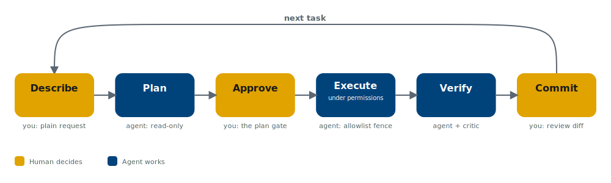

## By the end of the hour you leave with three things {.smaller}

::: {.lede}
The promise, stated on slide one.
:::

- A **mental map** of the AI-in-economics literature, in three lenses.
- A **cloneable repository** implementing a minimal agentic pipeline for wiiw working-paper production.
- A **realistic cost and infrastructure picture**, in euros per month, for running it.

::: {.catch}
**Design philosophy — smallest viable practical.** Not 18 agents and 52 skills.
The *minimum* set of components that makes delegating research work to an AI agent both safe and productive. That minimum has **five pieces**.
:::

::: {.src}
Repository: **[github.com/lusiki/AI_workshop_wiiw](https://github.com/lusiki/AI_workshop_wiiw)** — clone it this afternoon.
:::

# 0 · Hook {.center}

The technology is already inside the research production function.

## Adoption is happening — the only question is whether it is deliberate {.smaller}

::: {.cols}
::: {.col}
**Diffusion, at unprecedented pace**

[Chatterji et al. (2025)](https://www.nber.org/papers/w34255) — population-scale usage across *asking, doing, expressing*, spanning work and personal life.
:::
::: {.col}
**The canonical causal microevidence**

[Brynjolfsson, Li & Raymond (2025, *QJE*)](https://www.nber.org/papers/w31161) — a customer-support deployment: average productivity **+14–15%**, gains concentrated among the *newest* workers, the skill distribution **compressed**.
:::
:::

These tools already change **who** produces knowledge work and **how fast**.
For a research institute, the open question is not *whether* — it is *deliberate vs accidental* adoption.

## A frame economists already own: this is a principal–agent problem {.smaller}

- **You** are the principal. **The model** is a capable, tireless, occasionally overconfident agent.
- Its output is **cheap to produce and costly to verify.**
- Everything today — the plan gate, the permission fence, the quality score — is **contract design under asymmetric information.**

::: {.catch}
This single framing carries the whole hour: **the binding constraint is your verification, not the machine's generation.**
:::

# 1 · Three lenses on AI in economics {.center}

Tool · Instrument · Object

## Lens A — AI as a *tool* that shifts the research production function {.smaller}

- **[Korinek (2023, *JEL*)](https://doi.org/10.1257/jel.20231736)** — founding taxonomy. LLMs assist across the whole pipeline; usefulness rises as **verification cost falls**. *Verification cost is the organizing variable.*
- **[Korinek (2025, NBER)](https://www.nber.org/papers/w34202)** — the shift this seminar is about: **chatbots → agents**. An agent is *model + tools + memory + iteration*.
- **[Dell (2025, *JEL*)](https://arxiv.org/abs/2407.15339)** — deep learning as **data creation**: OCR, embeddings, linkage unlock trapped sources.
- **[Bahoo et al. (2025)](https://doi.org/10.1111/joes.12694)** — the adoption map across subfields.
- **[Sant'Anna (2026)](https://github.com/pedrohcgs/claude-code-my-workflow)** — the practitioner's missing manual. *Deployed in Part 2.*

::: {.src}
For wiiw: historical CESEE statistics, national gazettes and firm registries become tractable.
:::

## Lens B — AI as an *instrument*, with warnings {.smaller}

::: {.catch}
**[Ludwig, Mullainathan & Rambachan (2025, NBER)](https://www.nber.org/papers/w33344)** — the discipline paper. LLM outputs enter a pipeline **two** valid ways: **prediction** (needs an out-of-training-sample argument you cannot inspect) or **estimation** (needs a **human-labelled gold-standard** subsample). Otherwise measurement error contaminates estimates.
:::

- **[Athey, Keleher & Spiess (2025)](https://arxiv.org/abs/2310.08672)** — predicting *who is worst off* ≠ predicting *who responds*. Whom to nudge is **causal**.
- **[Gavrilova et al. (2025)](https://www.ifo.de/en/cesifo/publications/2023/working-paper/difference-difference-causal-forests-application-payroll-tax)** — causal forests *inside* a DiD design: heterogeneity from the algorithm, **identification from the design**.
- **[Chen, Cheng, Liu & Tang (2026)](https://www.nber.org/papers/w34713)** — theory-guided transfer learning: structure regularizes a flexible learner; biggest gains in **small samples**.

**One rule for the room:** no machine-generated variable enters a regression without a human-labelled validation set.

## Lens C — AI as an *object* of study, and a force on the profession {.smaller}

- **[Acemoglu (2025)](https://www.nber.org/papers/w32487)** — sober task-based benchmark: cumulative TFP gains **< 1pp** over a decade. A defensible lower bound.
- **[Jones (2026)](https://www.nber.org/papers/w34779)** — the growth-theory counterweight. *Weak links* cap gains at the hard human tasks — yet automating *nearly everything* still delivers large acceleration. The debate is about **timing and bottlenecks**, not direction.
- **[Brynjolfsson, Korinek & Agrawal (2026)](https://www.nber.org/papers/w34256)** — the research agenda if AI is transformative. A menu of wiiw-sized questions: CESEE convergence, labour reallocation, nearshoring.
- **[Mullainathan (2025)](https://doi.org/10.1257/pandp.20251118)** — algorithms now sit *inside* the economy as decision-makers. **The profession itself is part of the treatment group.**

## The bridge {.center .smaller}

::: {.r-fit-text}
Lens A: these tools **raise** research productivity.
:::

Lens B: they are **dangerous inputs** unless disciplined.
Lens C: the stakes are **macroeconomic**.

::: {.catch}
Part 2 shows how to get the **Lens A gains** while enforcing the **Lens B discipline**.
:::

# 2 · Anatomy of an agentic pipeline {.center}

The five components — and the failure each one prevents.

## The operating loop is the entire rhythm {.smaller}

{fig-alt="describe, plan, approve, execute under permissions, verify, commit, then next task"}

You write plain-language requests and approve plans. The agent does everything between **approval** and the **verification report**. You review the diff and say *commit*.

## Context & the plan gate {.smaller}

::: {.cols}
::: {.col}
[1]{.chip} **Context — `CLAUDE.md`**

The project constitution the agent reads every session. Lean (~120 lines): principles, folders, commands, current state. Path-scoped rules load only when the agent touches matching files (R rules with any `.R`, house style with the manuscript).

*Prevents:* the agent forgetting decisions and reverting to generic defaults.
:::
::: {.col}
[2]{.chip} **The plan gate**

For any nontrivial task the agent plans in **read-only** mode, saves the plan to disk, and waits for approval. Plans survive context compaction and create an audit trail.

*Prevents:* solving the wrong problem fast — and losing the reasoning behind choices.
:::
:::

## Permissions & verification {.smaller}

::: {.cols}
::: {.col}
[3]{.chip} **Permission-scoped execution**

A settings file allowlists exactly which commands run without asking — `Rscript`, `quarto render`, read-only `git`. Destructive git, `rm -rf`, and reads under `data/restricted/` are **denied**.

*Prevents:* an autonomous process with unbounded ability to touch the machine.
:::
::: {.col}
[4]{.chip} **Verification**

Never "done" without compiling, rendering or testing. Three mechanisms: **replication-first**, an **adversarial critic → fixer** loop, and **numeric provenance** — every quoted number anchored to the script that produced it.

*Prevents:* confident nonsense reaching the working paper.
:::
:::

## Memory & git — and how it all binds {.smaller}

[5]{.chip} **Memory & git.** Corrections accumulate as tagged one-liners (mistakes made once). Git is the safety net: small commits, an advisory quality score (80 to commit, 90 for a PR, 95 excellence), worktrees for risky experiments.

::: {.catch}
**Context** makes the agent competent · **the plan gate** makes it aligned · **permissions** make it contained · **verification** makes it honest · **git** makes it reversible.

Remove any one and a specific, nameable failure mode returns.
:::

::: {.src}
Extensions for later — skills, subagents, MCP servers — are refinements of these five. Start with the constitution and two or three skills.
:::

# 3 · Live demonstration {.center}

A wiiw working-paper section, produced end to end.

## The artifact, and the stack {.smaller}

**Income convergence in the CESEE EU members since accession** — a small staggered event study around the 2004 / 2007 / 2013 waves. Data public, econometrics familiar: all attention on the **workflow**.

::: {.cols}
::: {.col}
- `eurostat` → live data pull
- `fixest` (Sun & Abraham) + `did`
- `modelsummary` tables
:::
::: {.col}
- Quarto → wiiw-branded PDF
- `renv` pins versions
- `targets` = one-command pipeline
:::
:::

::: {.src}
The workflow guide and the modern DiD estimator in `did` **share an author** — Pedro Sant'Anna.
:::

## The catch — verification fails the build on a stale number {.smaller}

One plain-language request, planning first:
*"Extend the sample through 2025, refresh Figure 2, rerun the event study, and update the results paragraph."*

1. The agent enters **plan mode**, writes the plan, and waits for approval. **Approval is the moment of delegation.**
2. Execution then runs inside the **permission fence**: only allowlisted commands (`Rscript`, `quarto render`, read-only `git`) proceed; destructive git and reads under `data/restricted/` are blocked.

::: {.catch}
Verification finds a results number — **typed by hand** — that no longer matches the refreshed table. The adversarial critic flags it, a separate fixer restores the code-backed reference, and the render passes clean.

The pipeline catches the error a tired researcher on a deadline would ship.
:::

The loop then closes: `git diff` → advisory **quality score** → **commit** → the compiled, wiiw-branded PDF.

# 4 · Pricing & infrastructure {.center}

What it costs, in euros per month.

## Any laptop suffices — the model runs in the cloud {.smaller}

**Local:** a terminal, `git`, R, Quarto, a LaTeX distribution, Node.js ≥ 18 for Claude Code. No GPU. The repo ships a `setup.R` that checks all of it.

**Two ways to pay** (USD; verify at **claude.com/pricing** before the talk):

| Tier | Model | \$ / 1M in | \$ / 1M out | Use it for |
|---|---|--:|--:|---|
| Cheap | **Haiku 4.5** | 1 | 5 | mechanical: formatting, first-pass scans |
| Mid | **Sonnet 5** | 3 | 15 | review, drafting |
| High | **Opus 4.8** | 5 | 25 | identification, high-judgment steps |
| Frontier | **Fable 5** | 10 | 50 | hardest long-horizon work |

::: {.src}
Batch processing **−50%** · prompt caching cuts repeated context to **≈ 0.1×** input · Sonnet 5 intro pricing \$2 / \$10 through 2026-08-31.
Subscriptions: **Pro** \$20/mo (\$17 annual) · **Max** \$100 & \$200 · **Team** ≈ \$25 / \$125 per seat.
:::

## Cost engineering: route models, cache context, set effort {.smaller}

::: {.cols}
::: {.col}
**Route by task — the 70/20/10 pattern**

- **≈70%** mechanical → Haiku
- **≈20%** review → Sonnet
- **≈10%** high-judgment → Opus / Fable

Saves half or more vs running everything on the frontier tier.
:::
::: {.col}
**Two more levers**

- **Prompt caching** — keep system context stable across turns (most of an agentic session is repeated context).
- **Effort per task** — not maximum reasoning everywhere.
:::
:::

::: {.catch}
Honest order of magnitude: a full iteration of the demo pipeline plausibly costs **low single-digit dollars** on the mid tier at API rates. A subscription turns a working-paper habit into a flat, predictable line item. **Monitor with the built-in cost commands — trust no table, including this one.**
:::

## Data governance for an institute — three rules {.smaller}

1. **Restricted microdata never enter a prompt.** The agent edits code and reads *aggregated* outputs; raw restricted files live in paths the permission settings **deny**. The model orchestrates an analysis whose sensitive inputs it never sees.
2. **Prefer Team / Enterprise / API access** for institutional work; review the current commercial terms on training-data use before onboarding — not individual consumer accounts with default settings.
3. **For residency needs,** the same models are available through cloud providers with **EU-region endpoints**, at some setup friction.

**Plus one process rule:** pin the tool version in a shared config so an overnight release cannot silently change behaviour mid-project.

# 5 · Pitfalls & the division of labour {.center}

What never to delegate.

## Each pitfall ties back to a paper {.smaller}

- **Machine-labelled variables in a regression** without a validation subsample — *Ludwig, Mullainathan & Rambachan*. Encoded as a check in the data skill.
- **Training contamination** — anything on the public internet may sit inside the model; historical text/price exercises need an explicit **leakage argument**.
- **Fabricated citations** — the bibliography is built only from **fetched metadata**, never the model's memory of the literature; a claim-verification pass runs before submission.
- **Verification asymmetry** — generation is cheap, checking is dear. The five components exist to **industrialise the checking**.
- **The forking-paths problem gets worse** — 200 overnight specifications are a gift to honest robustness *and* a menace to selective reporting. Pair with **preregistration** or **full specification disclosure**.

## The division of labour {.smaller}

::: {.cols}
::: {.col}
**Agents excel at**

mechanical transformation · refactoring · formatting · first-pass literature scans · replication packaging · robustness sweeps
:::
::: {.col}
**Humans keep**

question choice · identification arguments · interpretation · ethical judgement · the final voice of the prose
:::
:::

::: {.catch}
**Jones's weak link** is the researcher's judgement — the complementary task that protects quality. **Brynjolfsson–Li–Raymond**: novices gain the most capacity, so **senior researchers matter more, not less** — review becomes the scarce input.
:::

# 6 · Close {.center}

## Three takeaways {.smaller}

1. **The literature gives you three lenses.** Tool, instrument, object. Know the flagship paper for each.
2. **The smallest viable pipeline has five parts.** Context, plan gate, permissions, verification, git. Start there, not with fifty skills.
3. **The binding constraint is your verification, not the machine's generation.** Design for cheap checking and honest numbers.

::: {.catch}
**Clone it this afternoon:** **[github.com/lusiki/AI_workshop_wiiw](https://github.com/lusiki/AI_workshop_wiiw)** — paste the starter prompt, produce a compiled section on your own machine.
:::

## The starter prompt {.smaller}

> I am starting to work on **[PROJECT NAME]** in this repository. **[Two sentences on the paper, the data, and the tools.]** I want our collaboration to be structured and rigorous even when that takes longer. Please read `CLAUDE.md` and the configuration in `.claude/`, then propose updates that fit my project. Use the **plan-first** workflow for every nontrivial task. Once I approve a plan, proceed autonomously and return to me only for decisions or ambiguity. **Verify every output by rendering or testing** before reporting it complete. For our first sessions, check in more often so I can learn how the workflow behaves.

## Reading list, mapped to the seminar {.smaller}

::: {.cols}
::: {.col}
- [Korinek (2023, *JEL*)](https://doi.org/10.1257/jel.20231736) — founding taxonomy — *A*
- [Korinek (2025, NBER)](https://www.nber.org/papers/w34202) — chatbots → agents — *A / 2*
- [Dell (2025, *JEL*)](https://arxiv.org/abs/2407.15339) — DL as data creation — *A*
- [Bahoo et al. (2025)](https://doi.org/10.1111/joes.12694) — adoption map — *A*
- [Sant'Anna (2026)](https://github.com/pedrohcgs/claude-code-my-workflow) — the practitioner manual — *2 / 3*
- [Ludwig, Mullainathan & Rambachan (2025)](https://www.nber.org/papers/w33344) — two valid uses — *B / 5*
- [Athey, Keleher & Spiess (2025)](https://arxiv.org/abs/2310.08672) — nudge whom — *B*
:::
::: {.col}
- [Gavrilova et al. (2025)](https://www.ifo.de/en/cesifo/publications/2023/working-paper/difference-difference-causal-forests-application-payroll-tax) — forests inside DiD — *B*
- [Chen, Cheng, Liu & Tang (2026)](https://www.nber.org/papers/w34713) — theory-guided TL — *B*
- [Brynjolfsson, Li & Raymond (2025, *QJE*)](https://www.nber.org/papers/w31161) — field evidence — *hook / 5*
- [Chatterji et al. (2025)](https://www.nber.org/papers/w34255) — usage at scale — *hook*
- [Acemoglu (2025)](https://www.nber.org/papers/w32487) — sober benchmark — *C*
- [Jones (2026)](https://www.nber.org/papers/w34779) — weak links vs acceleration — *C / 5*
- [Brynjolfsson, Korinek & Agrawal (2026)](https://www.nber.org/papers/w34256) — the agenda — *C*
- [Mullainathan (2025)](https://doi.org/10.1257/pandp.20251118) — objects & instruments — *bridge*
:::
:::

::: {.src}
Full verified notes on all 15 papers: **[reading/PAPERS.md](https://github.com/lusiki/AI_workshop_wiiw/blob/main/reading/PAPERS.md)** · Repository: **[github.com/lusiki/AI_workshop_wiiw](https://github.com/lusiki/AI_workshop_wiiw)**
:::
